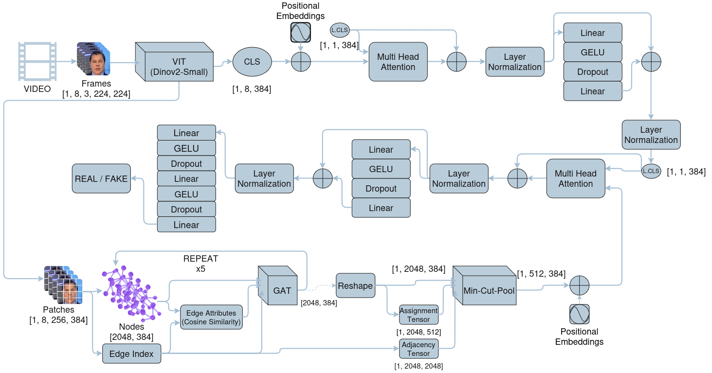
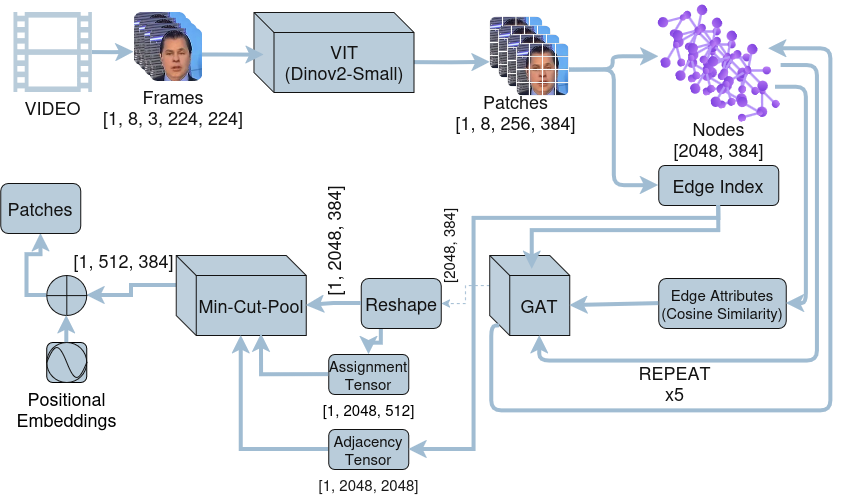
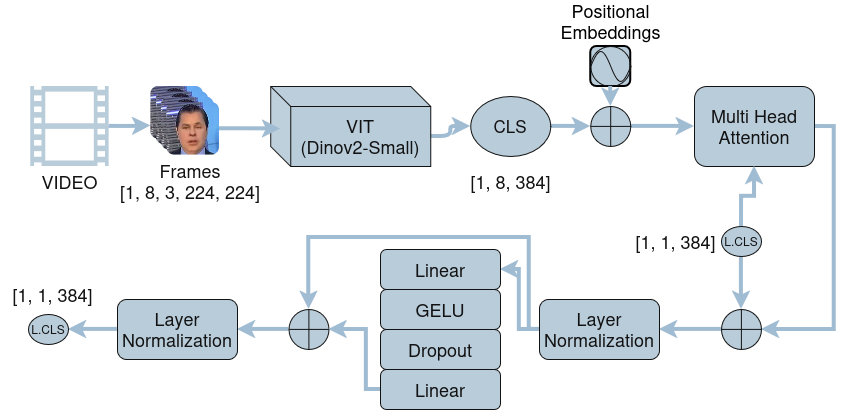
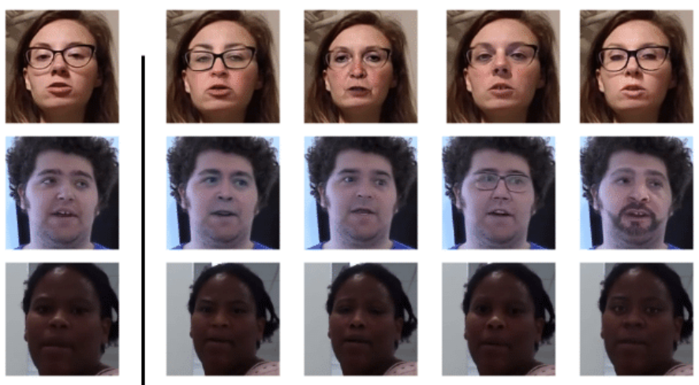
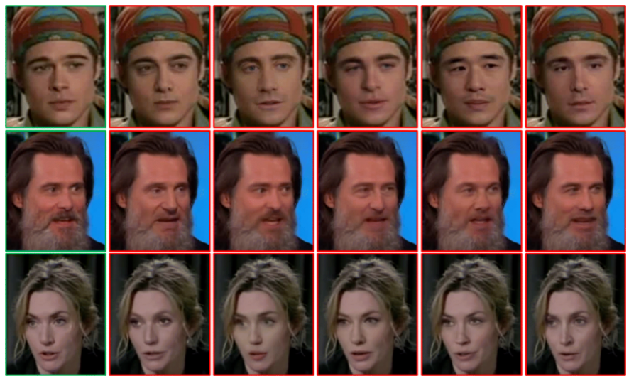

<h1 align="center">Cross-Dataset Deepfake Video Detection using Graph-Transformer</h1>

<p align="center">
  B.Sc. Thesis · Department of Computer Science and Engineering · University of Rajshahi
</p>

<!-- ======================================================================= -->
<!--                         IMAGES (TOP OF README)                           -->
<!--  Put your 5 images in an `assets/` folder and replace the placeholders.  -->
<!-- ======================================================================= -->

<!-- IMAGE 1 — e.g. overall architecture diagram -->
<p align="center">
  
</p>

<!-- IMAGE 2 — e.g. spatio-temporal graph construction -->
<p align="center">
  
</p>

<!-- IMAGE 3 — e.g. MinCut pooling / cluster visualization -->
<p align="center">
  
</p>

<!-- IMAGE 4 — e.g. cross-dataset results / ROC curves -->
<p align="center">
  
</p>

<!-- IMAGE 5 — e.g. qualitative examples -->
<p align="center">
  
</p>

---

## Table of Contents

1. [Overview](#overview)
2. [Key Contributions](#key-contributions)
3. [Method](#method)
   - [Stage 0 – Fine-tuning DINOv2](#stage-0--fine-tuning-dinov2-on-faceforensics)
   - [Stage 1 – Temporal branch](#stage-1--global-temporal-branch)
   - [Stage 2 – Spatio-temporal graph branch](#stage-2--spatio-temporal-graph-branch)
   - [Stage 3 – Cross-attention fusion and classifier](#stage-3--cross-attention-fusion-and-classifier)
   - [Training objective](#training-objective)
4. [Datasets](#datasets)
5. [Results](#results)
6. [Repository Structure](#repository-structure)
7. [Installation](#installation)
8. [Usage](#usage)
9. [Configuration Reference](#configuration-reference)
10. [Implementation Details](#implementation-details)
11. [Limitations and Notes](#limitations-and-notes)
12. [Citation](#citation)
13. [Acknowledgements](#acknowledgements)
14. [License](#license)

---

## Overview

Deepfake detectors usually perform well on the dataset they were trained on but drop sharply on forgeries created with different methods, compression settings or capture conditions. This thesis targets that gap: **cross-dataset generalization** for deepfake *video* detection.

The detector is trained **only on FaceForensics++ (FF++)** and then evaluated, with no further training, on four unseen datasets: **UADFV, Celeb-DF v1, Celeb-DF v2 and DFDC**.

The model combines two complementary views of a clip:

- a **global branch** that reasons over per-frame CLS tokens with temporal attention, and
- a **graph branch** that models local spatial and temporal relationships between ViT patch tokens with graph attention networks and learned graph pooling.

The two views are fused with cross-attention before the final real/fake decision. The backbone is **DINOv2 ViT-S/14**, a self-supervised vision transformer, which is first fine-tuned on FF++ and then kept frozen inside the video model.

---

## Key Contributions

- **Self-supervised backbone.** DINOv2 ViT-S/14 is used as the feature extractor, with partial fine-tuning on FF++ (last two transformer blocks and all normalization layers).
- **Spatio-temporal patch graph.** Each 8-frame clip becomes a graph of 8 × 256 = 2,048 patch nodes, with spatial k-NN edges inside each frame and temporal edges between the same patch location in adjacent frames.
- **GATv2 with dynamic edge features.** Edge attributes are cosine similarities between node features and are recomputed after every graph layer.
- **MinCut pooling.** The 2,048-node graph is softly clustered into 512 nodes using a learned assignment, with the MinCut and orthogonality auxiliary losses.
- **Attention-based dual-branch fusion.** A global clip vector queries the pooled graph clusters via multi-head cross-attention.
- **Focal loss plus auxiliary graph losses**, and config-driven training and testing.
- **Strict cross-dataset protocol.** Training uses FF++ only; every other dataset is held out entirely.

---

## Method

### Pipeline at a glance

```
Video clip (8 frames, 3×224×224)
        │
        ▼
 DINOv2 ViT-S/14 (fine-tuned on FF++, then frozen)
        │
        ├── CLS tokens   [B, 8, 384]  ───────────────┐
        │                                            ▼
        │                              Stage 1: temporal multi-head attention
        │                              (learnable CLS query over 8 frame tokens)
        │                                            │  cls_vec [B, 1, 384]
        │                                            │
        └── Patch tokens [B, 8×256, 384]             │
                 │                                   │
                 ▼                                   │
     Stage 2: spatio-temporal graph                  │
     GATv2 × L layers (cosine edge features)         │
     → assignment network → MinCut pooling           │
     → 512 cluster nodes [B, 512, 384]               │
                 │                                   │
                 └────────────► Stage 3: cross-attention
                                (cls_vec queries clusters)
                                          │
                                          ▼
                                  MLP classifier → [real, fake]
```

### Stage 0 – Fine-tuning DINOv2 on FaceForensics++

Script: `fine_tune.py`

The DINOv2 ViT-S/14 backbone (`dinov2_vits14`, loaded through `torch.hub` from `facebookresearch/dinov2`) is adapted to the deepfake task on single frames before it is used in the video model.

| Item | Setting |
|---|---|
| Trainable parts | Last 2 transformer blocks + all normalization layers (LayerNorm, BatchNorm, GroupNorm, InstanceNorm variants). The rest is frozen. |
| Head | `concat(CLS, mean(patch tokens))` (768-d) → Linear 512 → GELU → Dropout → Linear 256 → GELU → Dropout → Linear 2 |
| Dropout | 0.3 |
| Optimizer | AdamW, separate learning rates: ViT 1e-5, head 1e-4, weight decay 1e-2 |
| Schedule | Step-based linear warmup (2 epochs) followed by cosine decay |
| Loss | Cross-entropy with label smoothing 0.05 |
| Precision | Mixed precision (fp16 autocast with GradScaler) on CUDA |
| Gradient clipping | max-norm 1.0 |
| Epochs / batch size | 30 / 32 |
| Early stopping | patience 6 on AUC |
| Augmentation (p = 0.5) | Horizontal flip, brightness ×[0.9, 1.1], contrast ×[0.9, 1.1], Gaussian blur (p = 0.3, σ ∈ [0.1, 1.0]) |
| Input | Resize to 224×224, ImageNet mean/std normalization |

The best checkpoint (by AUC) is saved to `vit_weights/best_vit_checkpoint.pth`, and only its `vit.*` weights are loaded into the video model.

### Stage 1 – Global temporal branch

For each clip, the frozen backbone produces one CLS token per frame (`[B, 8, 384]`).

1. A learnable temporal positional embedding is added to the 8 CLS tokens.
2. A **single learnable CLS query** attends over the 8 frame tokens with multi-head attention (8 heads).
3. The result goes through a residual connection + LayerNorm, then a feed-forward network (384 → 512 → 384, GELU, dropout) with another residual connection + LayerNorm.

The output `cls_vec` (`[B, 1, 384]`) is a compact description of the whole clip.

### Stage 2 – Spatio-temporal graph branch

**Nodes.** Every patch token of every frame is a node. With 224×224 input and patch size 14, each frame has a 16×16 grid = 256 patches, so a clip has 8 × 256 = **2,048 nodes**, each with a 384-d feature from DINOv2.

**Edges** (built once, shared by all videos):

- **Spatial edges:** inside each frame, every patch is connected to its **8 nearest neighbours** on the patch grid (Euclidean distance on grid coordinates). The graph is symmetrized so edges are undirected.
- **Temporal edges:** each patch is connected, in both directions, to the patch at the **same grid position** in the previous and next frame.

**Message passing.**

- `L` stacked **GATv2Conv** layers (default 5), each with 8 heads of dimension 48 (concatenated back to 384), dropout and self-loops.
- Each layer receives a 1-d **edge attribute: the cosine similarity** between the two endpoint features. It is recomputed after every layer from the updated node features, so the edge weighting evolves with depth.
- GELU is applied after each layer.

**Graph pooling.**

- A linear **assignment network** (384 → 512) predicts soft cluster assignments for each node.
- `dense_mincut_pool` (from PyTorch Geometric) coarsens the graph into **512 cluster nodes** (`[B, 512, 384]`) and returns two auxiliary losses: the **MinCut loss** and the **orthogonality loss**.

### Stage 3 – Cross-attention fusion and classifier

1. A learnable positional embedding is added to the 512 cluster nodes.
2. `cls_vec` acts as the **query** and the clusters act as **keys and values** in multi-head attention (8 heads). In effect, the global clip representation decides which graph regions are relevant.
3. Residual + LayerNorm, followed by a feed-forward network (384 → 512 → 384) with residual + LayerNorm.
4. Classifier MLP: 384 → 384 → 256 → 2 with GELU and dropouts (0.3 and 0.2).

### Training objective

```
L_total = L_focal + λ_mincut · L_mincut + λ_ortho · L_ortho
```

- **Focal loss** (γ = 2.0) on the real/fake logits to focus training on hard examples.
- **MinCut loss** encourages clusters that cut few strongly connected edges (coherent regions).
- **Orthogonality loss** encourages balanced, non-degenerate clusters.
- Default weights: `λ_mincut = 1.0`, `λ_ortho = 1.0`.

---

## Datasets

| Dataset | Role | Notes |
|---|---|---|
| **FaceForensics++ (FF++)** | Train (+ in-domain test split) | The only dataset used for training. |
| **UADFV** | Cross-dataset test | Unseen during training. |
| **Celeb-DF v1** | Cross-dataset test | Unseen during training. |
| **Celeb-DF v2** | Cross-dataset test | Unseen during training. |
| **DFDC** | Cross-dataset test | Unseen during training. |

> The datasets are **not included** in this repository. Please obtain them from their official sources and follow their licenses and terms of use.

### Data format

Each dataset is described by a JSON file in `rearrange/dataset_json/` with `train` and `test` lists. Every entry is one video, stored as a list of extracted face-frame image paths.

```json
{
  "train": [ ["path/to/video1/frame_000.png", "path/to/video1/frame_001.png", "..."], "..." ],
  "test":  [ ["path/to/video2/frame_000.png", "..."], "..." ]
}
```

**Labels are derived from the file path** (`Real = 0`, `Fake = 1`):

- paths containing `real` or `original` → 0
- paths containing `fake`, `manipulated` or `synthesis` → 1
- DFDC paths encode the label after a `+` separator in the path string

Frames are resized to 224×224 and normalized with ImageNet statistics (mean `[0.485, 0.456, 0.406]`, std `[0.229, 0.224, 0.225]`). The video model takes **8 frames per clip**.

---

## Results

All models are trained on **FF++ only**. Metrics are computed on the full test set of each unseen dataset using a **0.5 decision threshold**; AUC is the primary metric.

| Dataset | AUC | Accuracy | Precision | Recall | TN | FP | FN | TP |
|---|---|---|---|---|---|---|---|---|
| UADFV | **0.9096** | 0.8061 | 0.7344 | 0.9592 | 32 | 17 | 2 | 47 |
| Celeb-DF v1 | **0.8835** | 0.7953 | 0.7683 | 0.9887 | 170 | 237 | 9 | 786 |
| Celeb-DF v2 | **0.8911** | 0.9085 | 0.9107 | 0.9913 | 339 | 548 | 49 | 5590 |
| DFDC | **0.7815** | 0.6912 | 0.6757 | 0.7721 | 1277 | 834 | 513 | 1738 |

Confusion-matrix convention: Real = 0, Fake = 1.

### Reading the numbers

- AUC is **≈ 0.88–0.91 on UADFV and both Celeb-DF versions**, and **0.78 on DFDC**, the hardest dataset, which has very diverse capture conditions and manipulation methods.
- **Recall is high** (up to 0.99), so the model rarely misses a fake. The cost is a number of false positives on real videos at the fixed 0.5 threshold, visible in the FP column for Celeb-DF.
- **Accuracy is class-balance dependent.** Celeb-DF v2 has 887 real vs 5,639 fake test videos, so its accuracy (0.9085) is dominated by the fake class. AUC is the fairer cross-dataset comparison.
- Threshold calibration across datasets was not performed; the 0.5 threshold is fixed.

---

## Repository Structure

> Adjust folder and file names if your layout differs.

```
.
├── imgs/                      # README images
├── configs/
│   ├── train2.yaml               # training configuration
│   └── test2.yaml                # cross-dataset testing configuration
├── helpers/
│   └── dataset_loader.py        # get_dataset(json_root, dataset_name, transform)
├── models/
│   └── final.py                 # FusedModel (graph-transformer detector)
├── rearrange/
│   └── dataset_json/            # FaceForensics++.json, Celeb-DF-v1.json, Celeb-DF-v2.json, UADFV.json, DFDC.json
├── vit_weights/
│   └── best_vit_checkpoint.pth  # fine-tuned DINOv2 (output of fine_tune.py)
├── checkpoints/                 # best_model.pth, last_checkpoint.pth
├── logs/                        # training logs + hyperparams.json per run
├── test_logs/                   # test logs + test_results.json per run
├── fine_tune_vit.py                 # Stage 0: DINOv2 fine-tuning on FF++
├── train2.py                     # trains FusedModel (config driven)
├── test2.py                      # cross-dataset evaluation
└── README.md
```

---

## Installation

```bash
git clone https://github.com/Ishmam-Zahin/My_Thesis_Repo.git
cd <My_Thesis_Repo>

python -m venv venv
source venv/bin/activate      # Windows: venv\Scripts\activate
```

Install PyTorch for your CUDA version from <https://pytorch.org>, then PyTorch Geometric following its [official instructions](https://pytorch-geometric.readthedocs.io), then the remaining dependencies:

```bash
pip install numpy pillow scikit-learn pyyaml tqdm torchinfo torchvision
```

Main dependencies: `torch`, `torchvision`, `torch_geometric`, `scikit-learn`, `numpy`, `Pillow`, `PyYAML`, `tqdm`, `torchinfo`.

The DINOv2 backbone is downloaded through `torch.hub` (`facebookresearch/dinov2`), so the first run needs internet access.

A CUDA GPU is strongly recommended. Training on 2,048-node graphs with batch size 6 is memory-intensive.

---

## Usage

### 1. Prepare the data

Create the dataset JSON files described in [Data format](#data-format) and place them in `rearrange/dataset_json/`.

### 2. Fine-tune DINOv2 on FF++ (Stage 0)

```bash
python fine_tune.py
```

Paths are defined at the top of `main()` in `fine_tune.py` (JSON locations and the output folder). The best checkpoint is written to `vit_weights/best_vit_checkpoint.pth`.

### 3. Train the graph-transformer (Stages 1–3)

```bash
python train.py --config configs/train2.yaml
```

Each run creates a timestamped folder under `logs/<model_name>/run_<timestamp>/` containing `training.log` and `hyperparams.json`. Checkpoints are written to `checkpoints/<model_name>/`:

- `best_model.pth`: best validation AUC
- `last_checkpoint.pth`: latest epoch (use `resume: true` in the config to continue training)

### 4. Evaluate on unseen datasets

```bash
python test.py --config configs/test2.yaml
```

Per-dataset metrics (loss, accuracy, AUC, precision, recall, confusion matrix) are logged and saved to `test_logs/<model_name>/test_run_<timestamp>/test_results.json`.

---

## Configuration Reference

### `configs/train.yaml`

```yaml
data:
  json_root: "<path>/rearrange/dataset_json"
  dataset_name: "FaceForensics++"

model:
  model_path: "<path>/models/final.py"
  model_class: "FusedModel"
  vit_name: "dinov2_vits14"
  vit_weight: "<path>/vit_weights/best_vit_checkpoint.pth"
  num_gcn_layers: 5
  num_clusters: 512
  num_heads: 8
  mlp_dim: 512
  dropout: 0.4

training:
  epochs: 50
  batch_size: 6
  lr: 0.00005
  optimizer: "AdamW"
  weight_decay: 0.0005
  num_frames: 8
  focal_gamma: 2.0
  mincut_weight: 1.0
  ortho_weight: 1.0

paths:
  checkpoint_dir: "<path>/checkpoints"
  log_dir: "<path>/logs"

early_stopping:
  patience: 5
  delta: 0.0005

seed: 42
device: "cuda"
resume: false
```

### `configs/test.yaml`

```yaml
model:
  model_path: "<path>/models/final.py"
  model_class: "FusedModel"
  vit_name: "dinov2_vits14"
  checkpoint_path: "<path>/checkpoints/final/best_model.pth"
  vit_weight: "<path>/vit_weights/best_vit_checkpoint.pth"
  train_config_path: "<path>/configs/train.yaml"   # model hyperparameters are read from here

data:
  json_root: "<path>/rearrange/dataset_json"
  dataset_names:
    - "UADFV"
    - "Celeb-DF-v1"
    - "Celeb-DF-v2"
    - "DFDC"

paths:
  log_dir: "<path>/test_logs"

training:
  batch_size: 8
  num_frames: 8
  device: "cuda"
  seed: 42
```

Models are loaded **dynamically** from `model_path` / `model_class`, so a new architecture can be tested by pointing the config to a different file without touching the training or test scripts.

---

## Implementation Details

- **Backbone handling.** The DINOv2 extractor is frozen and always kept in `eval()` mode, even when the parent model is training. Features are extracted under `torch.no_grad()`, so only the temporal branch, graph branch, fusion block and classifier are trained in the video model.
- **Graph batching.** Each clip's patch features are wrapped into a PyG `Data` object that shares the same precomputed edge index; clips are merged with `Batch.from_data_list`. After the GATv2 layers, node features are reshaped back to `[B, 2048, 384]` for dense MinCut pooling.
- **Optimization.** AdamW, learning rate 5e-5, weight decay 5e-4, `ReduceLROnPlateau` (mode = max on validation AUC, factor 0.5, patience 2), gradient clipping at 1.0.
- **Model selection.** The best checkpoint is chosen by validation AUC with early stopping (patience 5, minimum delta 0.0005).
- **Reproducibility.** Seeds for Python, NumPy and PyTorch are set from the config (`seed: 42`). Note that cuDNN benchmark mode is enabled in `fine_tune.py`, so GPU runs may still differ slightly.
- **Test-time behaviour.** The test loader uses `drop_last=False` so every sample is evaluated. The model has no BatchNorm in its video stage, so a final batch of size 1 is safe in `eval()` mode.
- **Logging.** Per-epoch training and validation losses are logged separately for the focal, MinCut and orthogonality terms, along with AUC, accuracy, precision, recall and the confusion matrix.

---

## Limitations and Notes

- **DFDC remains the hardest benchmark** (AUC 0.78). Generalization to highly diverse, in-the-wild capture conditions is still an open problem for this approach.
- **Fixed 0.5 threshold.** Precision and accuracy vary strongly across datasets because of class balance and score calibration. AUC is the recommended comparison metric.
- **Validation split in fine-tuning.** The Stage 0 fine-tuning script uses the FF++ test split for checkpoint selection and early stopping. This does not touch the cross-dataset results, but any in-dataset FF++ number should be interpreted with that in mind.
- **Compute cost.** The graph has 2,048 nodes per clip, so memory use grows quickly with batch size and the number of GATv2 layers.
- **Research use only.** This code is intended for academic research on deepfake detection. It is not a production-grade detector and should not be used as sole evidence about the authenticity of any media.

---

## Citation

If you use this work, please cite:

```bibtex
@thesis{zahin2026deepfake,
  title  = {Cross-Dataset Deepfake Video Detection using Graph-Transformer},
  author = {Zahin, Md. Ishmam},
  school = {University of Rajshahi},
  year   = {2026},
  type   = {B.Sc. Thesis}
}
```

---

## Acknowledgements

- [DINOv2](https://github.com/facebookresearch/dinov2) by Meta AI Research for the self-supervised vision transformer backbone.
- [PyTorch Geometric](https://pytorch-geometric.readthedocs.io) for GATv2 and dense MinCut pooling.
- The creators of FaceForensics++, Celeb-DF, UADFV and DFDC for releasing their datasets.


---

## Author

**Md. Ishmam Zahin**
[GitHub](https://github.com/Ishmam-Zahin) · [LinkedIn](https://www.linkedin.com/in/md-ishmam-zahin-19749a365/) · [Portfolio](https://ishmam-zahin.github.io/My-Portfolio/) · ishmamzahin404@gmail.com